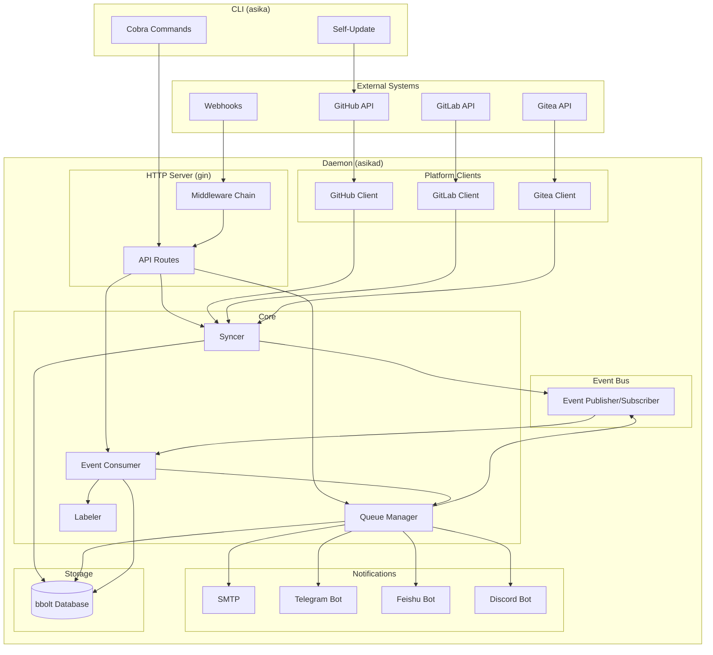
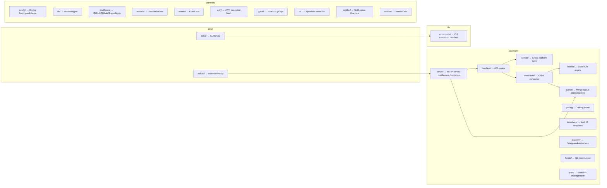

## Architecture



## Development

### Project Structure



### Running Tests

```bash
# All tests
go test ./common/... ./lib/... ./daemon/...

# Specific package
go test ./common/config/...

# Specific test
go test ./common/config -run TestLoad
```

### Build Commands

```bash
# Build both binaries
go build -o asika ./cmd/asika
go build -o asikad ./cmd/asikad

# With version info
go build -ldflags="-X 'asika/lib/commands.Version=v1.0.0'" -o asika ./cmd/asika

# Clean up
rm -f asika asikad
```
